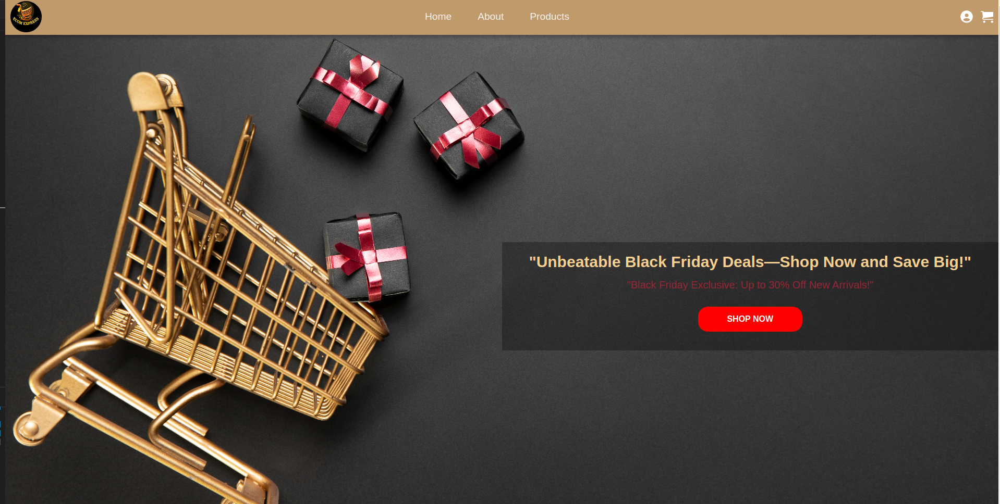

# 🛒 **Ecom Express** 

## About The Project

**Ecom Express** is a modern, responsive e-commerce platform built with **React**. It offers a seamless shopping experience with features like product browsing, login validation, cart management, and more. Designed with scalability and performance in mind, **Ecom Express** provides a solid foundation for building robust online stores.

## Table of Contents
- [🛒 **Ecom Express**](#-ecom-express)
  - [About The Project](#about-the-project)
  - [Table of Contents](#table-of-contents)
  - [Demo](#demo)
  - [Features](#features)
  - [Technologies Used](#technologies-used)
  - [Installation](#installation)
  - [Usage](#usage)
  - [Project Structure](#project-structure)
  - [Built with:](#built-with)
  - [Components Overview:](#components-overview)
  - [Team members:](#team-members)
  - [Acknowledgements](#acknowledgements)

## Demo
  - Click on the image to watch the Demo 
  [](https://drive.google.com/file/d/1Q36InB7vnMKdB1D6PISh9rHjK0Ce_-X6/view?usp=sharing)


## Features

- 📱 **Responsive Design**: Optimized for all devices including desktops, tablets, and mobile phones.
- 🔒 **User Authentication**: Secure login and registration functionality.
- 🛍️ **Product Listing**: Browse and search through a wide range of products.
- 🛒 **Shopping Cart**: Add, remove, and manage products in your cart.
- 🌍 **Context Management**: Global state management using React Context API.
- ♻️ **Reusable Components**: Modular and reusable components like Header, Footer, HeroSection, Button, etc.
- 🧭 **Easy Navigation**: Intuitive layout and routing for a smooth user experience.

## Technologies Used

- **Frontend:**
  - ⚛️ **React**
  - 🌐 **React Router**
  - 📦 **Context API**
  - 🎨 **CSS3 / Tailwind CSS**
- **Tools:**
  - 🛠️ **Node.js**
  - 📦 **npm / Yarn**
  - 🗂️ **Git & GitHub**

## Installation

1. **Clone the repository:**
   ```bash
     git clone https://github.com/yourusername/ecom-express.git
   ```


2. **Install dependencies:**
   
   ```bash
     npm install
   ```


3. **Run the Project:**
   
   ```bash
      npm run dev
   ```

   

## Usage

**Once the project is running:**

🎯 Visit http://localhost:3000 to access the application.
🛍️ Use the navigation menu to explore products, manage your cart, and log in for a personalized shopping experience.

## Project Structure

```bash
 ecom-express/
├── public/
│   ├── index.html
│   └── ...
├── src/
│   ├── components/
│   │   ├── About/
│   │   ├── Products/
│   │   ├── Login/
│   │   ├── Cart/
│   │   ├── Context/
│   │   ├── Header/
│   │   ├── Footer/
│   │   ├── HeroSection/
│   │   └── Layout/
│   ├── assets/
│   ├── App.js
│   ├── index.js
│   └── ...
├── .gitignore
├── package.json
├── README.md
└── ...
```

## Built with:


⚛️  React - JavaScript library for building user interfaces.

🌍 React Router - For client-side routing.

🌐 Context API - For managing global state in a lightweight, scalable way.

🖌️ styled-components - For writing CSS in JavaScript with a component-based approach.


## Components Overview:

📝 About: Provides information about Ecom Express and its mission.

🛒 Products: Lists available products, typically retrieved from an API or mock data source.

🔑 Login: Allows users to log in or register.

🛍️ Cart: Displays items added by the user, with options to modify quantities or remove items.

🌍 Context (GlobalContext.js): Manages global state (e.g., user data, cart items) using the React Context API.

🧭 Header & Footer: Persistent navigation and footer for site-wide links and information.

🎯 HeroSection: Highlights promotions or featured products.

🗂️ Layout: Wraps components to create a unified page structure across the site.


## Team members:

👤 Tabassum Alim Khan

👤 Ashwini

👤 Nikolas Wolf

👤 Tuanthong Vaidyanond


## Acknowledgements

🎨 Tailwind CSS for styling and responsive design.

🖌️ styled-components for making styling in React more convenient.

⚛️ React Documentation for development guidance and support.

🛠️ Vite for fast builds and server-side rendering.